<h1 align="center">Tide Island Extended</h1>

<p align="center">
  <b>An independently maintained and enhanced fork of Tide Island for Hyprland and niri.</b>
</p>

<p align="center">
  <a href="https://github.com/Bimbok/Tide-island-extended/stargazers"></a>
  <a href="https://github.com/Bimbok/Tide-island-extended/issues"></a>
  <a href="https://github.com/enhaoswen/Tide-island"></a>
  
  
  
</p>

<p align="center">
  <b>Upstream:</b> <a href="https://github.com/enhaoswen/Tide-island">enhaoswen/Tide-island</a>
</p>


<p align="center">
  <a href="#preview">Preview</a>
  ·
  <a href="#features">Features</a>
  ·
  <a href="#installation">Installation</a>
  ·
  <a href="#configuration">Configuration</a>
  ·
  <a href="#common-commands">Common Commands</a>
  ·
  <a href="#notification-centre">Notification Centre</a>
</p>

---

## About Tide Island Extended

Tide Island Extended is a desktop widget for Hyprland and niri, styled like the Dynamic Island.

When nothing much is going on, it sits compactly in your bar or corner, staying out of the way. When you need to check information, it expands into an interactive panel where you can view lyrics, switch workspaces, adjust system settings, check notifications, view weather, or inspect custom system statistics.

It is built with Quickshell, QML, and C++/Qt 6. Animations are tuned to be fluid and responsive while keeping resource usage minimal.

> [!NOTE]
> ### About This Project
>
> **Tide Island Extended** is an independently maintained and enhanced fork of [Tide Island](https://github.com/enhaoswen/Tide-island), originally created by [**@enhaoswen**](https://github.com/enhaoswen).
>
> The original Tide Island project provided the core architecture, animation system, Dynamic Island concept, and foundation on which this project is built.
>
> **Tide Island Extended has its own development direction and codebase.** It is not intended to remain in direct sync with upstream. Selected ideas, features, fixes, or improvements from the original project may be incorporated when they are considered meaningful and suitable for this project, adapted and integrated into the codebase as needed.
>
> Beyond these upstream-inspired improvements, Tide Island Extended also introduces its own features, integrations, performance improvements, UI refinements, and other enhancements.


<br>

## Preview

### Dynamic Island Capsules

<p align="center">
  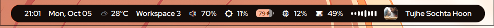
</p>

<table>
  <tr>
    <td width="50%" align="center">
      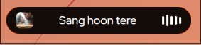
    </td>
    <td width="50%" align="center">
      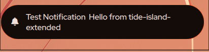
    </td>
  </tr>
</table>

### Interactive Panels

<table>
  <tr>
    <td width="50%">
      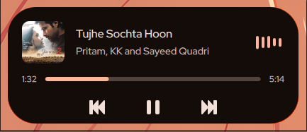
    </td>
    <td width="50%">
      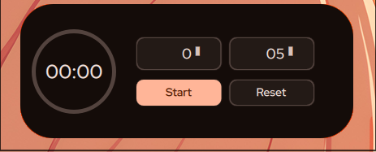
    </td>
  </tr>
  <tr>
    <td width="50%">
      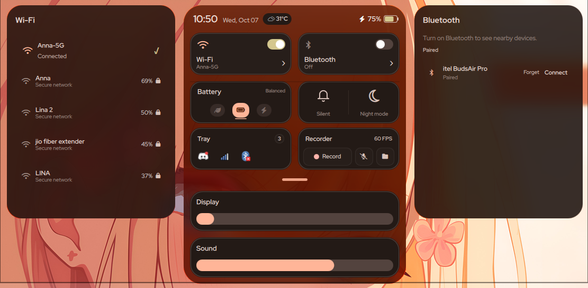
    </td>
    <td width="50%">
      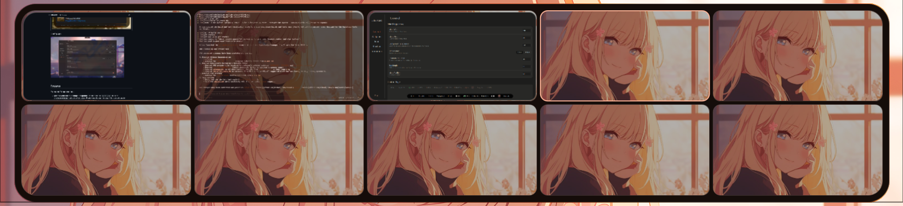
    </td>
  </tr>
  <tr>
    <td width="50%">
      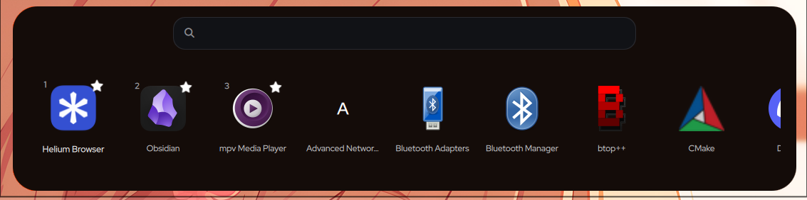
    </td>
    <td width="50%">
      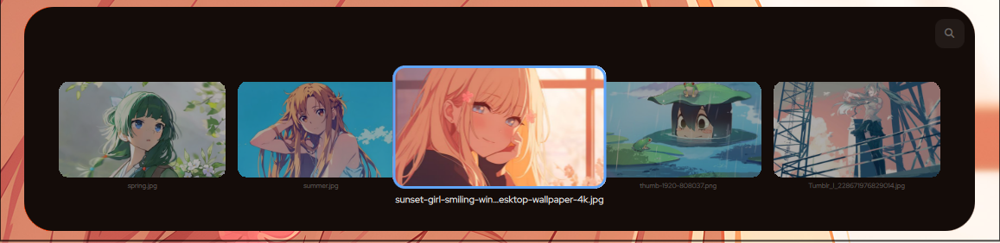
    </td>
  </tr>
  <tr>
    <td width="50%">
      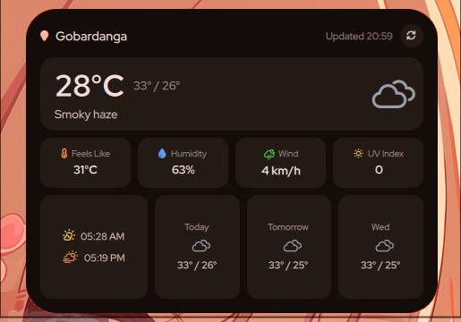
    </td>
    <td width="50%">
      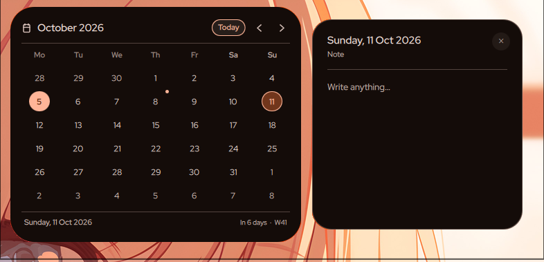
    </td>
  </tr>
  <tr>
    <td width="50%">
      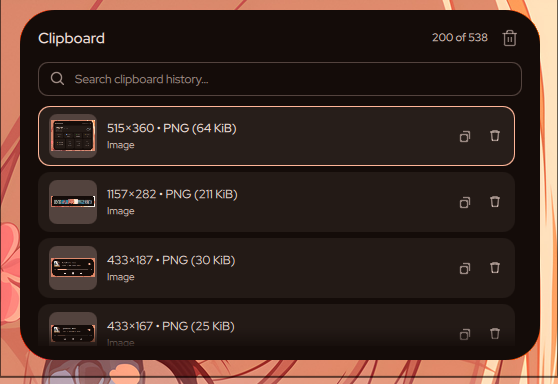
    </td>
    <td width="50%">
      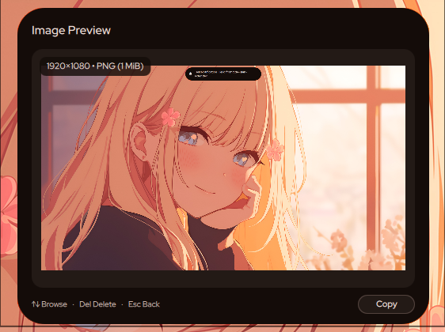
    </td>
  </tr>
</table>

### Config App

<p align="center">
  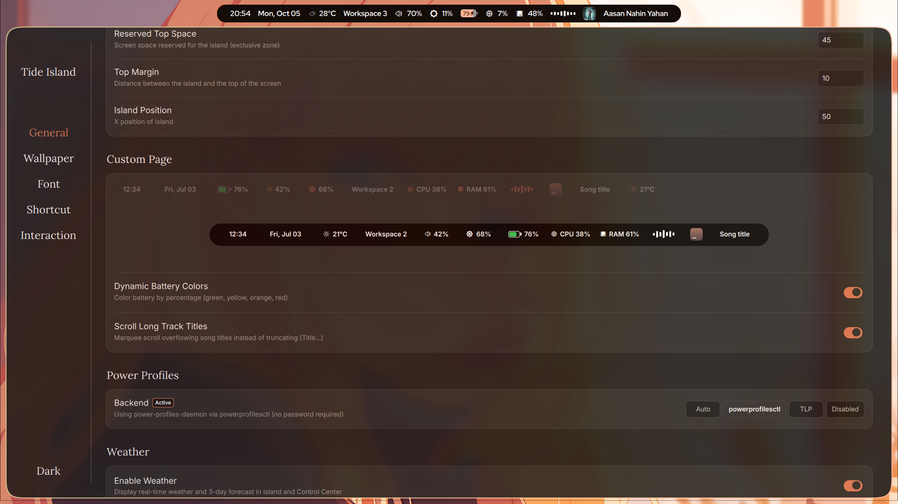
</p>
<br>

## Features

### Extended Enhancements

- **Dynamic Color Palette & Matugen Integration**: Live hot-reloads of `colors.json` on disk via `QFileSystemWatcher` without service restarts. Ready-to-use Matugen template with preserved capsule translucency (`islandBackgroundOpacity`).
- **Dynamic Battery Color Progression**: Battery pill smoothly shifts colors based on charge level (critical, warning, nominal, charging) with full Matugen color matching and an on/off toggle in settings.
- **Marquee Track Title Scrolling**: Clean, smooth auto-scrolling for long song titles with an initial 1.8s reading pause and seamless looping, plus an instant toggle in the Config App to fall back to static ellipsis (`Title...`) for 0% CPU.
- **Unified Icon Weight Harmony**: Clean, consistent icon line weights across volume, brightness, battery, and weather.
- **Optimized State Management**: In-place reactive property updates for custom info layers, eliminating unnecessary delegate re-instantiations and flickers.

### Core Features

- Clock
- Music player
- Control Center
- Timer
- Lyrics displayer
- Application launcher
- File shelf
- Clipboard history manager
- Weather & Forecast
- Calendar
- Wallpaper switcher
- Workspace overview
- Custom page
- Notification Centre
- Power menu

Clipboard history requires `cliphist` and `wl-clipboard`. Tide Island starts the clipboard watcher automatically while it is running.
Click a date in the calendar to write a note. Dates with notes show a small dot; notes are saved automatically.


### System Feedback

- Volume changes
- Brightness changes
- Battery charging / discharging
- Workspace changes
- Media playback (optional)
- System notifications


### Custom Page

- Time
- Date
- Battery
- Volume
- CPU usage
- Current workspace
- Memory usage
- Brightness
- Cava
- Storage usage
- Weather

### Compositor support

- Hyprland: full current experience, including Tide's workspace overview, workspace animations, shortcuts, and Night Light through `hyprsunset`.
- niri: island views, focused-output IPC commands, workspace change hints, native niri overview, shortcuts through `~/.config/tide-island/niri-shortcuts.kdl`, and Night Light through `gammastep`.
- Tide checks `TIDE_ISLAND_COMPOSITOR` first, then `$XDG_CURRENT_DESKTOP`. It uses `$NIRI_SOCKET` only when the desktop environment is inconclusive, then falls back to Hyprland. This prevents inherited compositor sockets from causing a false detection.

<br>

## Installation

### From Source (All Distributions)

Clone the repository and run the automated installer:

```bash
git clone https://github.com/Bimbok/Tide-island-extended.git
cd Tide-island-extended
./install.sh
```

The installer builds Tide Island, writes it to `/usr`, registers desktop and service files, and automatically handles dependencies on:

- **Arch Linux, EndeavourOS, Manjaro, CachyOS** (using `pacman`)
- **Debian, Ubuntu, Linux Mint, Pop!_OS** (using `apt`)
- **Fedora, RHEL, Nobara** (using `dnf`)
- **openSUSE** (using `zypper`)

> [!TIP]
> If you previously installed the older AUR `tide-island` package, remove it before running the installer:
> ```bash
> sudo pacman -R tide-island
> ./install.sh
> ```

For other distributions, install dependencies manually and run:

```bash
./install.sh --skip-deps
```

Quickshell is used from `/usr/bin/quickshell` when available. Otherwise the installer builds the pinned, verified Quickshell version compatible with this release. Qt 6.6 or newer is required.

Useful installer options:

| Option | Description |
| --- | --- |
| `./install.sh --no-service` | Install Tide Island without enabling or starting the systemd user service. |
| `./install.sh --skip-quickshell` | Skip building Quickshell from source and use existing `/usr/bin/quickshell`. |
| `./install.sh --force-build-quickshell` | Rebuild and install the project's pinned Quickshell version even if Quickshell is already installed. |
| `./install.sh --uninstall` | Remove the Tide Island files installed by the source installer. |

### Updating

To update Tide Island Extended to the latest version:

```bash
cd Tide-island-extended
git pull
./install.sh
```

<br>

## Starting Tide Island

Tide Island provides a systemd user service.

Enable and start it immediately (Recommended):

```bash
systemctl --user enable --now tide-island.service
```

If you want to manage startup manually, add this to your `hyprland.conf`:

```conf
exec-once = tide-island
```

Or add this to `hyprland.lua`:

```lua
hl.exec_once("tide-island")
```

If the systemd service is already enabled, you do not need to add `exec-once`.

<br>

## Configuration

Search `Tide Island Settings` in any application launcher, or run:

```bash
tide-island-config-app
```

- **Shortcuts**: Configure shortcuts for Workspace Overview, Application Launcher, Music Player, Notification Center, Control Center, Clipboard History (`Super + V`), Weather (`Super + E`), and Calendar (`Super + K` by default).
- **Interaction**: Configure click actions for the dynamic island pill (Left, Middle, and Right mouse buttons for Player, Control Center, and Clipboard History).
- **Weather**: Configure auto-detection or custom city name, temperature units (°C or °F), and refresh interval.
- **Calendar**: Quick month view with week numbers and relative date indicators. Click the date in the Control Center, press `Super + K`, or use the scroll wheel / arrow keys to browse months. Press `Home` to return to today, and `Esc` to close.
- **Color Palette & Matugen**: Tide Island supports dynamic system-wide color palettes generated by tools like [Matugen](https://github.com/InioX/matugen) or customized manually in `~/.config/tide-island/colors.json`.
  - **Live Auto-Reload**: Palette updates on disk are automatically detected and reloaded instantly via `QFileSystemWatcher` without restarting the service.
  - **Transparency Preserved**: Island capsule background transparency (`islandBackgroundOpacity`) continues to work seamlessly alongside dynamic palette tints.
  - **Matugen Template**: A template is provided in `templates/tide-island-colors.json`. Add this to your `~/.config/matugen/config.toml`:
    ```toml
    [templates.tide_island]
    input_path = '~/.config/matugen/templates/tide-island-colors.json'
    output_path = '~/.config/tide-island/colors.json'
    ```


## Common Commands

#### Restart after editing the configuration:

```bash
systemctl --user restart tide-island
```

#### Stop Tide Island:

```bash
systemctl --user stop tide-island
```

#### View logs:

```bash
journalctl --user -u tide-island -f
```

#### IPC Commands

You can control Tide Island remotely using `quickshell ipc call`:

| Command | Action |
| --- | --- |
| `quickshell ipc call tide toggleCalendar` | Open or close calendar view |
| `quickshell ipc call tide openCalendar` | Open calendar view |
| `quickshell ipc call tide closeCalendar` | Close calendar view |
| `quickshell ipc call tide toggleWeather` | Open or close weather view |
| `quickshell ipc call tide openWeather` | Open weather view |
| `quickshell ipc call tide closeWeather` | Close weather view |
| `quickshell ipc call weather refresh` | Refresh weather data immediately |
| `quickshell ipc call tide toggleClipboard` | Open or close clipboard history |
| `quickshell ipc call tide openClipboard` | Open clipboard history |
| `quickshell ipc call tide closeClipboard` | Close clipboard history |
| `quickshell ipc call tide toggleNotificationCenter` | Open or close notification center |
| `quickshell ipc call tide openNotificationCenter` | Open notification center |
| `quickshell ipc call tide closeNotificationCenter` | Close notification center |
| `quickshell ipc call tide toggleApplicationLauncher` | Open or close application launcher |
| `quickshell ipc call tide reloadColors` | Reload color palette from colors.json |
| `quickshell ipc call theme reload` | Reload color palette from colors.json |

<br>

### Notification Centre

Click the × button on a notification card to dismiss it. Use **Clear All** to dismiss all notifications at once.

<br>

## Contributing

Issues, bug reports, design suggestions, and pull requests are all welcome.

-  only 1 topic per issue.
-  tell your ideas first before making a PR

## Acknowledgments

Heartfelt thanks and appreciation to:

- **[@enhaoswen](https://github.com/enhaoswen)**: The original creator and core architect of Tide Island, who built the remarkable foundation, animation engine, and vision for this Wayland dynamic island.
- **[@end-4](https://github.com/end-4)** for the workspace overview design inspiration
- **[@gozhuimeng](https://github.com/gozhuimeng)** for improving the lyrics backend
- **[@LatifKovani](https://github.com/LatifKovani)** for a significant improvement

---

<p align="center">
  <sub>
    A practical, beautiful, and highly customizable desktop experience for Wayland.
  </sub>
</p>
